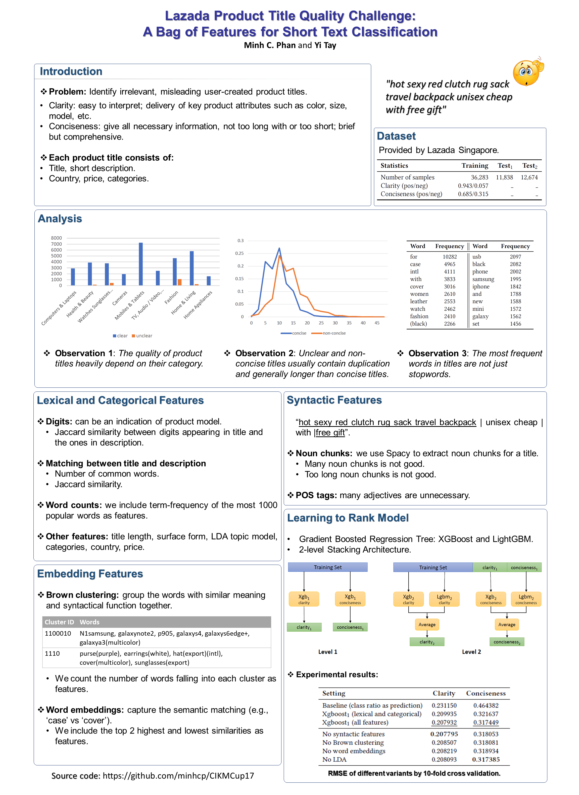

# Product Title Classification

This repository contains source code for our solution at the [CIKM AnalytiCup 2017 - Lazada Product Title Quality Challenge](https://competitions.codalab.org/competitions/16652).

# Problem
The task is to determine the quality of product titles created by public users on the e-commerce platform Lazada. We focus on two main objectives, namely **Clarity** and **Conciseness** which are described as follows:
* **Clarity** - The ease of readability and delivery of key product attributes such as color, size, model, etc. Product titles with high clarity scores should be easy to understand and interpret quickly.

* **Conciseness** - The optimal point of conveyed information with respect to product title length, i.e., the amount of redundant content in the product title. Product titles that do not contain all necessary information also violate this quality.

The problem is framed as two separate regression tasks which try to predict a score within [0,1], each for clarity and conciseness. The labels provided, however, are binary (0 or 1).

# Approach



# File description
### Input data files
The following data files are given by Lazada in the competition and can be re-downloaded from [here](https://drive.google.com/drive/folders/0B-rwT7IHM52ockZabnpvYVE3Z00):
```
./data/train/data_train.csv
./data/train/clarity_train.labels
./data/train/conciseness_train.labels
./data/test1/data_valid.csv
./data/test2/data_test.csv
```
### ConceptNet Numberbatch pre-trained word embeddings. Need to download [here](https://conceptnet.s3.amazonaws.com/downloads/2017/numberbatch/numberbatch-en-17.06.txt.gz):
```
./data/numberbatch-en.txt
```

### ./prepare_data.sh
The script will preprocess the input data and output into imtemidiate files. The following files will be generated by the script:
```
./data/train/data_train_preprocessed.csv
./data/test1/data_valid_preprocessed.csv
./data/test2/data_test_preprocessed.csv
./data/w2v.txt # Word2Vec embedding trained from the title and description corpus.
./brown-cluster-master/all_titles_lowercase.txt # Title corpus used as input for [Brown clustering](https://github.com/percyliang/brown-cluster).
./brown-cluster-master/all_titles_lowercase-c*-p1.out/*.* # Brown clustering results
```

### ./train_predict.sh
The scrip will extract features to create the training data files, and make predictions for the test samples.
The following files will be generated:
```
./to_submit/*.* # Preditions for test samples.
./data/predictions/*.* # Intermidiate files that contain k-fold predictions of training data
./data/extracted_features/*.* # The data files contain features that are extracted from training and test samples.
```

# Usage
To train and predict using the existing preprocessed files:
```
train_predict.sh
```
To re-create the all the preprocessed data files:
```
prepare_data.sh
train_predict.sh
```
